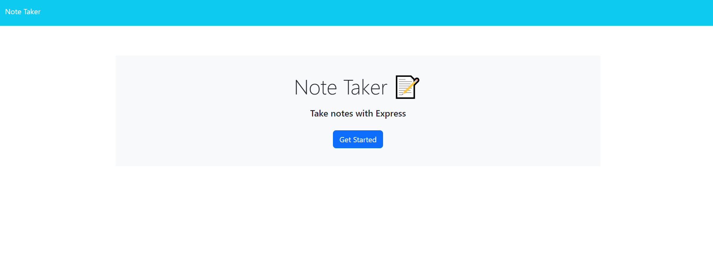
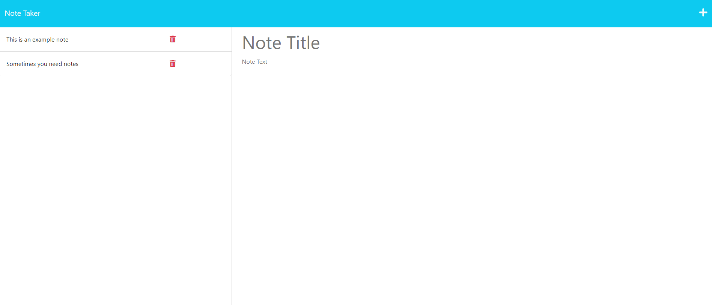

# Notetaker-app
  

## Description

Need an app that will keep track of all your notes? Well look no further this project is an app that will take in user notes and store then to a db.json file that has persistant storage. Don't need a note anymore just go ahead and hit that delete key and watch it disappear.

This was a code refactor of given starter code. With the starter code I had to add server.js, helper folder, and write all the express.js to get the project working.

## Table of Contents
* [Installation](#installation)
* [Usage](#usage)
* [License](#license)
* [Display](#display)
* [Contributors](#contributors)
* [Tests](#tests)
* [Questions](#questions)

## Installation
npm i

## Usage
Once npm i is used, visit the link below and click the "Get Started" button on screen to go the page to add notes. Type in a note title and message then press the save button. To delete press the red trashcan on the note and then refresh page to see the note is gone.

https://notetakerap-c591d539718a.herokuapp.com/

## License
For more information on this license, please visit https://mit-license.org/

## Display

## Contributors
N/A

## Tests
N/A

## Questions
rdheadyii@gmail.com

https://github.com/rdheadyii
